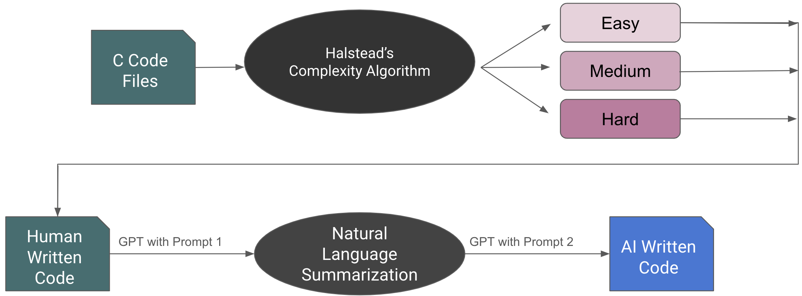

# CodeGuardian
In this project, we developed a tool that detect machine-generated code. To achieve this,
we fine-tuned RoBerta-base model with our self-collected data. This repository hold content for
1. Data Collection
2. Exploratory Data Analysis
3. Model Training and Deployment 

## Requirements
Since this repo involves training and tuning the model, please have the following packages installed before proceeding. Alternatively, you may choose to use tools like *Google Colab*. 
```
transformers
datasets
huggingface_hub
tensorboard == 2.11
git-lfs
torchvision
tensorflow
```

## Data collection
To collect the data for human and AI written code. For the human data, we used `codeParrot/github-code` dataset 
from Huggingface (url). To generate AI-written code and ensure that the AI code and human written code are comparable, we adopted the following pipeline:


To generate AI-written code, we adopted OpenAI's api and asychronously retrived response from ChatGPT model. The prompts are stored in `llm/prompts.json` file. We then used `llm/data_generation.py` to retrieve asych responses from the api. 