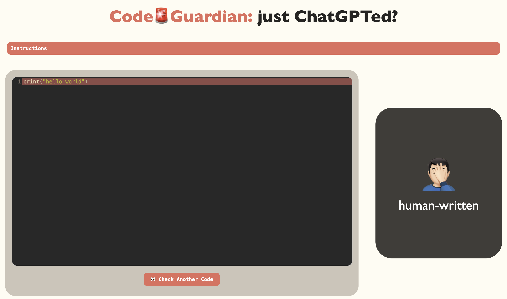
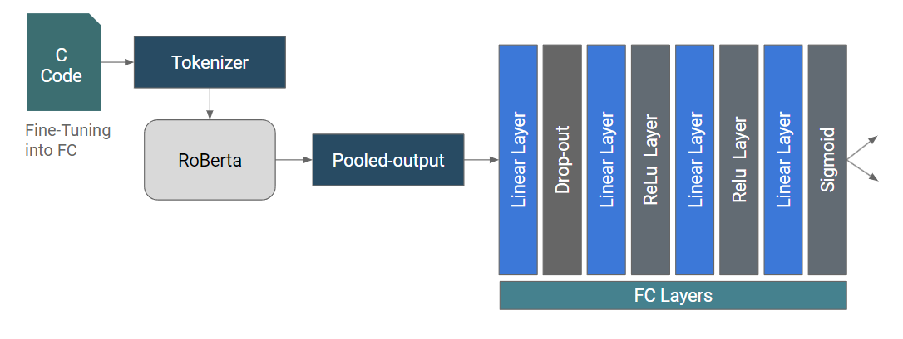
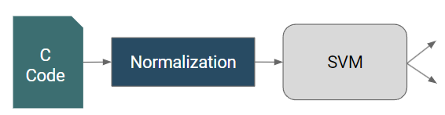

# CodeGuardian
In this project, we developed a tool that detects machine-generated code. To achieve this,
we fine-tuned the RoBerta-base model with our self-collected data and compared the results with SVM(Support Vector Machine). This repository holds content for
1. Data Collection
2. Exploratory Data Analysis
3. Model Training and Deployment 

## Demo
We developed a Flask web app to host our model. It can be accessed here: [demo](http://codecovenant.com/)

You can input a code snippet, and the model will classify whether it was written by a human or an AI. 
The lines that contributed the most to the prediction result will be highlighted in color.

## Requirements
Since this repo involves training and tuning the model, please install the following packages before proceeding. Alternatively, you may choose to use tools like *Google Colab*. 
```
transformers
datasets
huggingface_hub
tensorboard == 2.11
git-lfs
torchvision
tensorflow
```

## Data collection
To collect the data for human and AI written code. For the human data, we used `codeParrot/github-code` dataset 
from Huggingface (url). To generate AI-written code and ensure that the AI code and human written code are comparable, we adopted the following pipeline:


To generate AI-written code, we adopted OpenAI's api and asychronously retrived response from ChatGPT model. The prompts are stored in `llm/prompts.json` file. We then used `llm/data_generation.py` to retrieve asych responses from the api. 

## Exploratory Data Analysis
To ensure balance and fairness in our training data, we exploratorily analyzed our training data using `eda/EDA.ipynb`. Inside, we generated word cloud images and distribution of code file lengths in our data. 
You can follow the procedure in the notebook to see the outputs. 

## Training the model
In order to train our model, following pipelines are adopted:

### RoBerta-base


We trained our model using computing power from *Google Colab* in `roberta/roberta.ipynb`. You can follow the procedures inside to train the model. 


### SVM


The trained SVM model is included in 'SVM/SVM.ipynb.'

### Pre-trained model
To use our already fine-tuned model, you can directly use it from Huggingface. To use the pretrained tokenizer and 
model, run the following lines:

```
tokenizer = AutoTokenizer.from_pretrained("lebretou/code-human-ai")
model = AutoModelForSequenceClassification.from_pretrained("lebretou/code-human-ai")
```

To use the same encoder that we used, please download the pickle file `llm/label_encoder` with the following line:
```
# Load label encoder
with open('label_encoder.pkl', 'rb') as file:
    label_encoder = pickle.load(file)
```

## Evaluation Metrics
In this project, we employ several evaluation metrics to assess the performance of our deep learning models. These metrics provide insights into different aspects of model performance, particularly in terms of accuracy and the balance between precision and recall. Below is a description of each metric used:
1. Accuracy
Description: Accuracy measures the proportion of true results (both true positives and true negatives) among the total number of cases examined. It gives us a straightforward indication of the model's overall correctness across all classes.
Formula:

$$
\text{Accuracy} = \frac{\text{Number of Correct Predictions}}{\text{Total Number of Predictions}}
$$
 
- Interpretation: A higher accuracy indicates a model that generally predicts more correct outcomes, but it may not always be reliable if the data set is unbalanced between classes.

2. F1 Score
Description: The F1 score is the harmonic mean of precision and recall. It is a better measure than accuracy in scenarios where the class distribution is imbalanced. The F1 score can provide more insight into the balance of precision and recall in your model.
Formula:

$$
\text{F1 Score} = 2 \times \frac{\text{Precision} \times \text{Recall}}{\text{Precision} + \text{Recall}}
$$

- Interpretation: An F1 score reaches its best value at 1 (perfect precision and recall) and worst at 0. It is particularly useful when you need to balance precision (the accuracy of positive predictions) and recall (the ability of the model to find all the relevant cases).

3. AUC Score (Area Under the ROC Curve)
Description: The AUC score is the area under the Receiver Operating Characteristic (ROC) curve, which is a plot of the true positive rate against the false positive rate at various threshold settings. The AUC score represents the likelihood of the model distinguishing between the positive and negative classes.
Formula:

$$
\text{AUC Score} = \int_{x=0}^{1} \text{ROC curve}
$$

- Interpretation: An AUC score of 0.5 suggests no discriminative ability (equivalent to random guessing), while a score of 1.0 indicates perfect discrimination. A higher AUC value means a better performing model in terms of distinguishing between positive and negative classes across all thresholds.

## Results


## Future Work
Our project has laid a solid foundation and shown promising results. However, to further enhance the capabilities and applicability of our model, we are planning the following advancements:
1. Adopt RoBERTa-Large Model
- Objective: To leverage the increased model capacity of RoBERTa-Large for better understanding and generating context in our tasks. RoBERTa-Large, with its more extensive architecture, offers improved performance on a variety of NLP benchmarks, which could significantly boost the robustness and accuracy of our predictions. Or utilize data augmentation to artificially expand our dataset with more examples of long code entries, which will help in training our model to handle such cases effectively.

2. Improve Testing Accuracy on Ultra Long Code Entries
Challenge: Currently, our model is relatively inaccurate when dealing with long sequences of code, which are challenging due to their complexity and the requirement for maintaining long-term dependencies.
- Approach: One solution could be enhancing our model's attention mechanisms to handle long-distance dependencies in code better, possibly integrating more sophisticated variants like sparse or global attention.

3. Extension into More Languages
- Goal: To make our tool universally applicable by supporting multiple programming languages. This extension will help cater to a broader audience, including developers working in diverse coding environments and scenarios.
